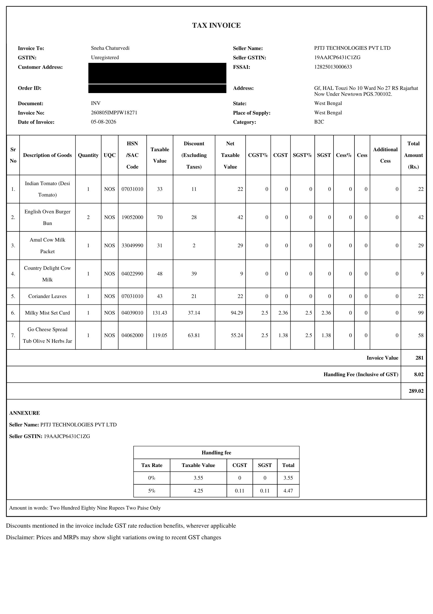

# InvoiceScan

InvoiceScan is a pipeline that reads an invoice PDF with OCR and asks Google Gemini to organize the recognized text into invoice fields and line items. It can reduce manual data entry, but its results are not guaranteed to be correct and should be checked against the invoice.

## Input

The notebook defaults to `Groceries_Invoice.pdf` in the project folder and processes its first page. The PDF is kept local and is not included in the GitHub repository. The redacted image below is the public sample of that input.



To use another PDF, update `IMAGE_PATH` in the first cell and the PDF-rendering cell.

## What Happens

1. PyMuPDF renders the first PDF page as an image.
2. OpenCV estimates and corrects page rotation.
3. EasyOCR recognizes text and records bounding boxes and confidence scores.
4. The notebook builds an extraction prompt and sends the OCR text to Gemini 2.5 Flash.
5. Gemini's JSON response is printed in the final notebook cell. The notebook does not save it as a `.json` file.

The notebook also creates preview images and word crops for inspection. Only the first page is processed; OCR and Gemini can misread or omit information.

## Example Output

This shortened, redacted excerpt shows the kind of JSON returned for the local sample PDF. The actual response includes additional invoice fields and line items.

```json
{
  "Invoice number": "[REDACTED]",
  "Invoice date": "[REDACTED]",
  "Buyer Name": "[REDACTED]",
  "Buyer Address": "[REDACTED]",
  "Seller Name": "PJTJ TECHNOLOGIES PVT LTD",
  "Items": [
    {
      "Description of Goods": "Indian Tomato (Desi Tomato)",
      "Quantity": 3,
      "HSN/SAC Code": "07031010",
      "Net Taxable Value": 22.0,
      "Total Amount": 22.0
    }
  ],
  "Invoice Value": 281.0,
  "Handling Fee": 8.02,
  "Final Amount": 289.02
}
```

The example is illustrative and contains redactions. The model can return incorrect values; review the complete response before using it.

## Model Accuracy

| Metric | Accuracy | Notes |
|---|---:|---|
| Main invoice metadata | 12/12 matched | Invoice number, invoice date, buyer, seller, GSTIN, and totals were correctly extracted |
| Item descriptions detected | 7/7 matched | All visible item names were identified |
| Fully correct line-item rows | 4/7 rows | Some rows had missing or partially incorrect quantity/tax values |
| Main-field practical accuracy | ~80% | Strong for header information and totals |
| Detailed line-item extraction accuracy | ~70% | Weaker for row-wise values such as quantity, discount, and tax columns |
| Overall accuracy | ~75-80% | Based on the sample invoice comparison |

## Setup and Run

Create a virtual environment, activate it, and install the dependencies:

```powershell
py -m venv .venv
.\.venv\Scripts\Activate.ps1
python -m pip install -r requirements.txt
```

On macOS or Linux, use `python3 -m venv .venv` and `source .venv/bin/activate` instead. Open `InvoiceScan.ipynb` in VS Code with the Jupyter extension or in JupyterLab, then select this environment as the notebook kernel. Internet access is needed on first run to download OCR models and the NLTK word list.

Before running the final cell, set a Gemini API key. For Windows PowerShell:

```powershell
$env:GEMINI_API_KEY = "your_api_key"
```

For macOS or Linux:

```bash
export GEMINI_API_KEY="your_api_key"
```

In the notebook's Gemini setup cell, replace `GEMINI_API_KEY = YOUR_API_KEY` with:

```python
import os

GEMINI_API_KEY = os.environ["GEMINI_API_KEY"]
```

Run the notebook cells in order. Never add a real API key or a private invoice to the repository.

## Project Files

- `InvoiceScan.ipynb` - the invoice processing workflow.
- `requirements.txt` - Python dependencies.
- `README.md` - project documentation.
- `input_invoice_redacted.png` - redacted preview of the sample invoice.
- `.gitignore` - keeps local PDFs and generated files out of Git.

Generated files include `invoice_page_1.png`, `aligned.jpg`, `final_image.jpg`, `invoice_page_1_with_boxes.png`, and `cutout_images_folder/`. They are local diagnostic outputs and can be recreated by running the notebook.

## Privacy

PDF rendering and OCR run locally. When the Gemini cell runs, the recognized invoice text is sent to Google's Gemini API. Only process invoices you are authorized to use, and do not publish personal or financial invoice information.
